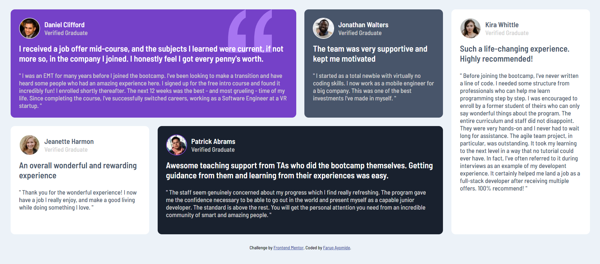

# Frontend Mentor - Testimonials grid section solution

This is a solution to the [Testimonials grid section challenge on Frontend Mentor](https://www.frontendmentor.io/challenges/testimonials-grid-section-Nnw6J7Un7). Frontend Mentor challenges help you improve your coding skills by building realistic projects. 

## Table of contents

- [Overview](#overview)
  - [The challenge](#the-challenge)
  - [Screenshot](#screenshot)
  - [Links](#links)
- [My process](#my-process)
  - [Built with](#built-with)
  - [What I learned](#what-i-learned)
- [Author](#author)

**Note: Delete this note and update the table of contents based on what sections you keep.**

## Overview

### The challenge

Users should be able to:

- View the optimal layout for the site depending on their device's screen size

### Screenshot
()

### Links

- Solution URL: [Add solution URL here](https://github.com/ofaruqayo/html-css-testimonial-grid)
- Live Site URL: [Add live site URL here](https://ofaruqayo.github.io/html-css-testimonial-grid/)

## My process
-I started the project by firstly using HTML to structure the content of the webpage
-I styled the webpage using mobile-first approach.
-Lastly I styled the web page to support desktop version
### Built with

- Semantic HTML5 markup
- CSS custom properties
- CSS Grid
- Mobile-first workflow

### What I learned

I Learnt how to use the CSS grid and realsed how easy it is.

To see how you can add code snippets, see below:

```css
.container{
        display: grid;
        gap: 20px;
        grid-template-columns: 1fr 1fr 1fr 1fr;
        grid-template-rows: 1fr 1fr;
    }
```

## Author

- Website - [Faruq Ayomide](https://ofaruqayo.github.io/personal-website-html-css/)
- Frontend Mentor - [@ofaruqayo](https://www.frontendmentor.io/profile/ofaruqayo)
